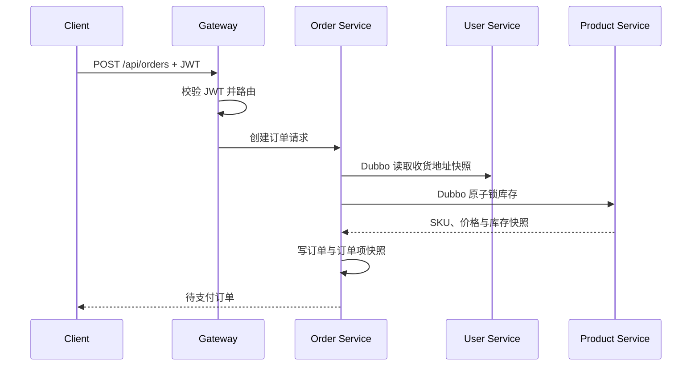

# 叮咚商城 v0.3 交易接口契约

> [!important] Gateway 入口
> 前端统一访问 Gateway：`http://127.0.0.1:8080`。除注册、登录、分类、品牌和商品浏览外，所有接口要求 `Authorization: Bearer <JWT>`。Gateway 与下游服务均校验签名；管理端还要求 `ADMIN` 角色。

## 1. 购物车

| 方法 | 路径 | 说明 |
|---|---|---|
| GET | `/api/cart/items` | 获取当前用户购物车及实时商品信息 |
| POST | `/api/cart/items` | 加入购物车；同 SKU 自动累加 |
| PUT | `/api/cart/items/{id}` | 更新数量和选中状态 |
| DELETE | `/api/cart/items/{id}` | 删除购物车项 |

```json
POST /api/cart/items
{"skuId": 9, "quantity": 2}
```

```json
PUT /api/cart/items/5
{"quantity": 3, "selected": true}
```

单个 SKU 最多加入 99 件；结算时仍由后端重新校验库存和价格，购物车价格不作为订单金额依据。

购物车以用户维度存入 Redis Hash：键为 `dingdong:cart:{userId}`，Hash field 为 SKU ID。接口中的购物车项 `id` 与 `skuId` 相同；Redis 不可用时返回 `CART_STORAGE_UNAVAILABLE`，不会回退到数据库或静默创建订单。

## 2. 创建订单

| 方法 | 路径 | 说明 |
|---|---|---|
| POST | `/api/orders` | 根据地址与购物车项创建待支付订单 |
| GET | `/api/orders?page=1&size=20` | 查询当前用户订单分页 |
| GET | `/api/orders/{orderNo}` | 查询当前用户订单详情 |
| POST | `/api/orders/{orderNo}/cancel` | 取消自己的待支付订单并释放锁定库存 |

```json
POST /api/orders
{
  "addressId": 3,
  "cartItemIds": [5, 6]
}
```

省略或传空 `cartItemIds` 时，结算所有已选中的购物车项。订单创建成功后，相关购物车项会删除。

```json
{
  "code": "OK",
  "data": {
    "orderNo": "DD20260716123456789001",
    "status": "PENDING_PAYMENT",
    "totalAmount": 25.00,
    "receiverName": "张三",
    "receiverPhone": "13800138000",
    "receiverAddress": "陕西省 西安市 雁塔区 科技路 1 号",
    "items": [
      {
        "skuId": 9,
        "skuCode": "DD-PRO-BLUE-128",
        "productTitle": "叮咚手机 Pro",
        "specJson": "{\"颜色\":\"蓝色\"}",
        "unitPrice": 12.50,
        "quantity": 2,
        "totalAmount": 25.00
      }
    ]
  }
}
```

## 3. 后端交易规则



- 产品服务以 `available_stock >= quantity` 条件更新锁定库存，失败即返回库存不足。
- 同一 `orderNo + skuId` 记录库存锁定流水，避免重复锁定。
- 订单项保存商品名称、图片、规格、单价和数量；订单保存收件人、电话与完整地址，因此商品/地址后续修改不会影响历史订单。
- 订单库写入失败时，订单服务调用产品服务释放已锁库存。

> [!note] 当前实现
> 支付成功确认扣减、用户取消释放库存与 RocketMQ 超时关单均已接入；本文件保留基础交易接口契约。

## 4. 主要错误码

| 错误码 | 含义 |
|---|---|
| `CART_ITEM_NOT_FOUND` | 购物车项不存在、不属于当前用户，或没有选中商品 |
| `CART_QUANTITY_LIMIT` | 单 SKU 购买数量超过 99 |
| `CART_STORAGE_UNAVAILABLE` | Redis 购物车暂不可用 |
| `INVENTORY_INSUFFICIENT` | 当前可用库存不足 |
| `INVENTORY_INVALID_QUANTITY` | 锁库存数量不合法 |
| `USER_ADDRESS_NOT_FOUND` | 收货地址不存在或不属于当前用户 |
| `ORDER_NOT_FOUND` | 订单不存在或不属于当前用户 |
| `ORDER_STATUS_INVALID` | 订单当前状态不允许取消 |
| `AUTH_UNAUTHORIZED` / `AUTH_TOKEN_INVALID` | 未登录、令牌无效或已过期 |
