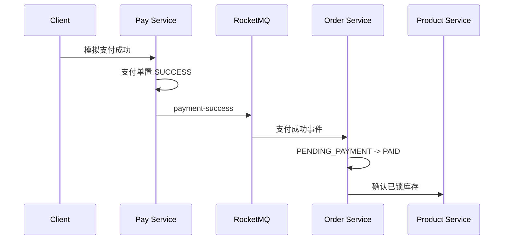

# 叮咚商城 v0.4 支付与履约接口契约

> [!important] 统一入口
> 所有接口经 Gateway `http://127.0.0.1:8080` 访问并携带 JWT。支付接口限订单所属买家；发货接口限 `ADMIN`。

## 1. 模拟支付

| 方法 | 路径 | 说明 |
|---|---|---|
| POST | `/api/payments` | 为待支付订单创建或返回已有支付单 |
| POST | `/api/payments/{paymentNo}/simulate` | 执行模拟成功或失败 |

```json
POST /api/payments
{"orderNo":"DD20260716123456789001"}
```

```json
POST /api/payments/PAY20260716123500001001/simulate
{"success":true}
```

支付单状态：`PENDING`、`SUCCESS`、`FAILED`。同一订单只允许一张支付单；重复成功请求直接返回成功结果，不会重复发布订单副作用。

## 2. 支付事件与订单状态



- 支付成功事件在支付本地事务提交后发送。
- 订单消费事件后仅允许 `PENDING_PAYMENT → PAID`；收到重复事件时返回成功，不会重复确认库存。
- 产品服务将锁定库存转为销量：`locked_stock` 减少、`sales` 增加；`available_stock` 不再变化。

## 3. 发货与确认收货

| 方法 | 路径 | 权限 | 说明 |
|---|---|---|---|
| POST | `/api/admin/orders/{orderNo}/shipment` | ADMIN | 对已支付订单模拟发货 |
| POST | `/api/orders/{orderNo}/confirm-receipt` | 买家本人 | 对已发货订单确认收货 |

```json
POST /api/admin/orders/DD20260716123456789001/shipment
{"carrier":"DingDong Express","trackingNo":"DDX202607160001"}
```

状态流转：`PENDING_PAYMENT → PAID → SHIPPED → COMPLETED`。每次状态变化写入 `order_status_log`，非法状态变化返回 `ORDER_STATUS_INVALID`。

> [!note] v0.4 边界
> 当前实现支付成功事件和订单幂等消费；支付超时关单、取消释放库存、发送失败补偿与 RocketMQ 事务消息增强进入 v0.5。

## 4. 主要错误码

| 错误码 | 含义 |
|---|---|
| `PAYMENT_NOT_FOUND` | 支付单不存在或不属于当前用户 |
| `PAYMENT_STATUS_INVALID` | 已失败支付单不可再次处理 |
| `ORDER_STATUS_INVALID` | 订单当前状态不允许支付、发货或确认收货 |
| `INVENTORY_CONFIRM_FAILED` | 已锁库存记录异常，无法确认扣减 |
| `AUTH_FORBIDDEN` | 非管理员访问发货接口 |
