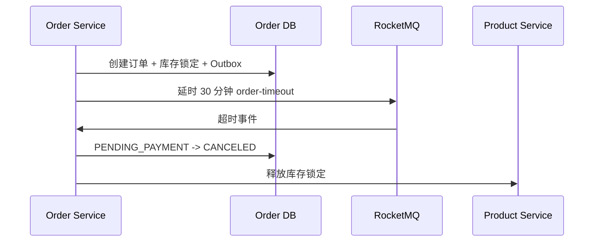

# 叮咚商城 v0.5 可靠性说明

> [!important] 对前端的影响
> 前端接口路径不新增。订单详情会在超时未支付后变为 `CANCELED`；商品详情接口保持 `/api/products/{id}`，服务端增加 Redis 缓存，对响应结构无影响。

## 1. 延时关单

创建待支付订单时，订单服务在同一数据库事务写入 `order_outbox` 事件。事务提交后向 RocketMQ `order-timeout` 主题发送 30 分钟延时消息。

- 只有 `PENDING_PAYMENT` 订单会关闭；已支付、已发货或已完成订单收到超时消息直接忽略。
- 以条件更新保证幂等：重复延时消息不会重复释放库存。
- 关闭成功后写入 `order_status_log`。

## 2. Outbox 重试补偿

| 状态 | 含义 |
|---|---|
| `PENDING` | 消息尚未发送成功，等待提交后发送或定时重试 |
| `SENT` | 已成功交给 RocketMQ |

发送异常时 `retry_count` 加一并记录 `last_error`；定时任务每 60 秒扫描最多 50 条 `PENDING` 事件重试。这样即使订单创建后的首次 RocketMQ 发送失败，也不会丢失关单任务。

## 3. 支付事件幂等

`payment-success` 消费端只允许订单从 `PENDING_PAYMENT` 迁移到 `PAID`。若已是 `PAID`，直接成功返回；产品库存确认同样只处理仍处于 `LOCKED` 的锁定记录。

## 4. 商品详情缓存

`GET /api/products/{id}` 使用键：`dingdong:product:detail:{spuId}`。

- TTL：10 分钟。
- 命中缓存时不查询 MySQL。
- 管理端修改 SPU 或 SKU 后立即删除对应缓存键。
- Redis 暂不可用时自动回退到 MySQL，不影响商品浏览主链路。

> [!warning] 当前边界
> Outbox 保障“延时关单消息最终可发送”；支付成功目前在本地事务提交后普通发送。后续简历完善版可升级为 RocketMQ 事务消息及更完整的死信/人工补偿台。
