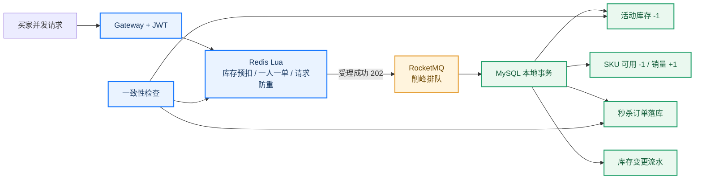
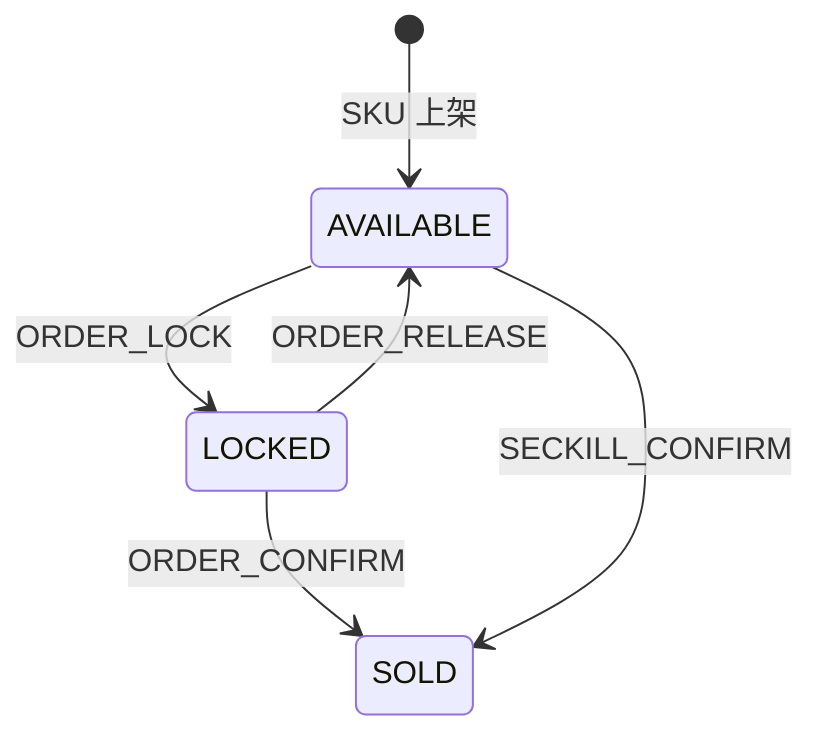

# API v0.6：并发库存、秒杀与管理增强

## 1. 版本目标

v0.6 将项目从“交易链路可用”推进到“并发机制可解释、状态可观测、结果可核对”。所有接口仍统一经过 Gateway `http://127.0.0.1:8080`，接口契约以本文件和既有版本化 Markdown 文档为准。

## 2. 管理侧用户

| 方法 | 路径 | 说明 |
|---|---|---|
| GET | `/api/admin/users` | 按关键字、角色、状态分页查询 |
| GET | `/api/admin/users/{id}` | 查询脱敏用户详情 |
| PUT | `/api/admin/users/{id}/status` | 启用或禁用普通用户 |

状态请求体：`{"status": 0}` 或 `{"status": 1}`。接口禁止管理员修改自己的状态，也禁止通过该入口停用其他管理员。

## 3. 库存流水与幂等

| 方法 | 路径 | 说明 |
|---|---|---|
| GET | `/api/admin/inventory/changes` | 按 SKU、业务类型查询变更流水 |
| POST | `/api/admin/inventory/skus/{skuId}/adjustments` | 使用 `requestId` 幂等调整可用库存 |

库存锁定、释放、支付确认和秒杀落库均在 SKU 行锁内完成，并写入唯一 `business_key`。流水保存可用、锁定、销量三个维度的变更量及前后快照。

普通下单新增可选 `requestId`；前端默认生成 UUID。`order_request(user_id, request_id)` 唯一约束负责并发防重。

## 4. 秒杀活动

### 买家接口

| 方法 | 路径 | 说明 |
|---|---|---|
| GET | `/api/seckill/activities` | 查询当前进行中的活动 |
| POST | `/api/seckill/activities/{id}/orders` | 提交秒杀请求，返回 202/PENDING |
| GET | `/api/seckill/orders/{requestId}` | 查询异步处理结果 |

提交体：`{"requestId":"客户端生成的 UUID"}`。同请求重复提交返回原状态；同一用户同一活动只能成功抢购一次。

### 管理接口

| 方法 | 路径 | 说明 |
|---|---|---|
| GET/POST | `/api/admin/seckill/activities` | 列表 / 创建活动 |
| POST | `/api/admin/seckill/activities/{id}/activate` | 激活并将 DB 活动库存预热到 Redis |
| POST | `/api/admin/seckill/activities/{id}/warmup` | 人工重建 Redis 活动库存 |
| POST | `/api/admin/seckill/activities/{id}/end` | 结束活动 |
| GET | `/api/admin/seckill/activities/{id}/consistency` | 比较 Redis、DB 库存与成功单量 |

一致性成立条件：`RedisStock == DatabaseStock == InitialStock - SuccessfulOrders`。消息仍在消费时，`pendingMessages` 会显示估算积压量；队列消费完成后应收敛为 0。

## 5. 支付闭环

- `POST /api/payments` 对同一订单幂等创建支付单；失败支付再次创建时恢复为待支付。
- `GET /api/payments/{paymentNo}` 查询支付结果。
- `POST /api/payments/{paymentNo}/simulate` 保留模拟成功/失败；成功后发布事件，订单条件迁移为 `PAID` 并确认普通订单锁定库存。

本版本仍不接真实渠道、不处理退款；目标是演示完整而克制的支付状态闭环。
