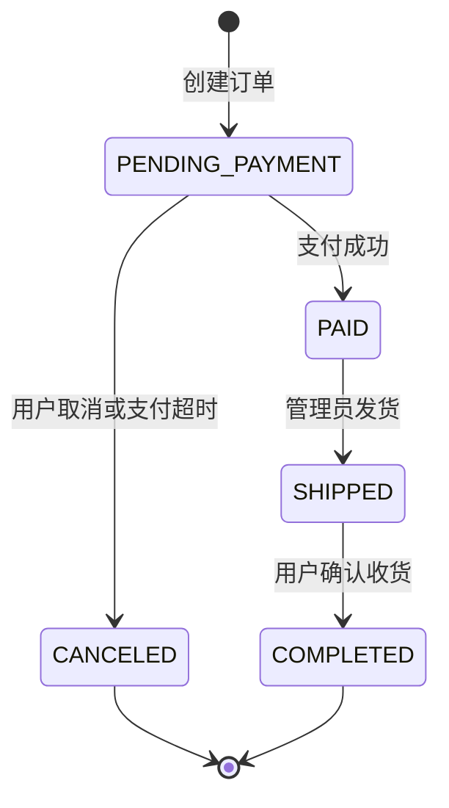
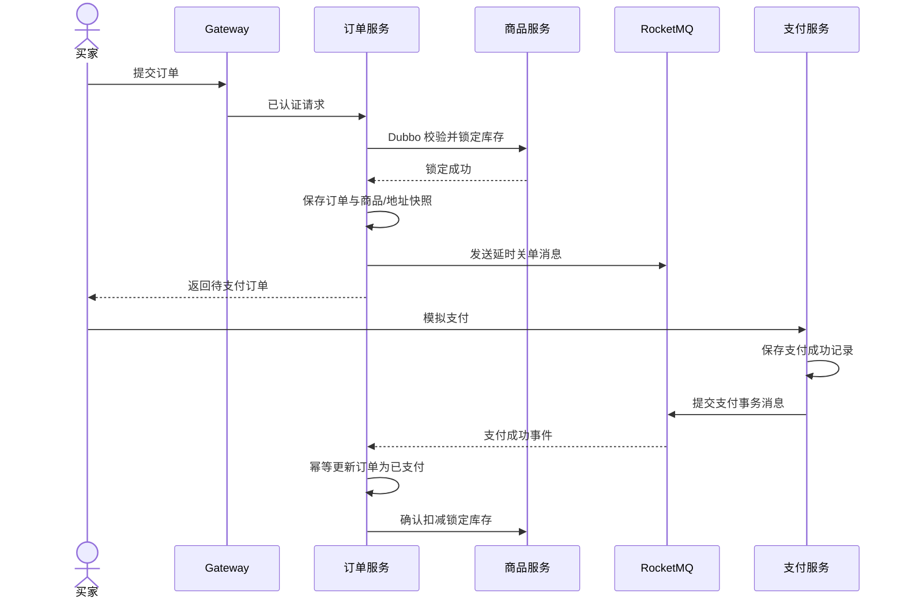
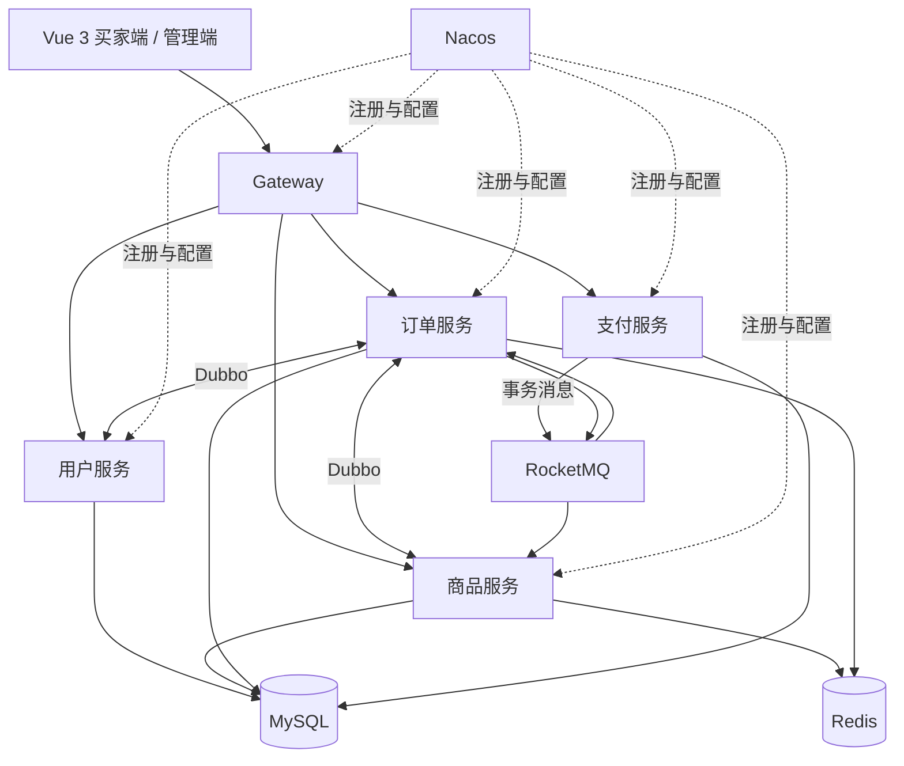

# 叮咚商城产品需求文档

> [!abstract] 项目定位
> 叮咚商城是一个面向实训交付与 Java 后端求职展示的前后端分离电商项目。项目不追求覆盖原题全部功能，而是优先完成可靠的交易闭环，并通过服务治理、缓存、消息队列和最终一致性体现分布式系统设计能力。

## 0. 文档说明

| 项目 | 内容 |
|---|---|
| 产品名称 | 叮咚商城（Ding Dong Mall） |
| 当前版本 | v0.8.0 |
| 文档状态 | 核心全栈联调完成，进入交付冻结与演示复核 |
| 实训截止日期 | ==2026-07-23（下周四）== |
| 目标用户 | 普通买家、商城管理员 |
| 项目类型 | 实训交付、个人简历项目 |
| 前端形态 | Vue 3 前后端分离 Web 应用 |
| 后端形态 | Spring Cloud Alibaba 微服务 |

### 0.1 文档导航

- [[#1. 项目背景与目标]]
- [[#3. 用户角色与权限]]
- [[#5. 功能需求]]
- [[#6. 核心业务流程]]
- [[#8. 服务与数据边界]]
- [[#9. 分布式场景设计]]
- [[#11. 非功能需求]]
- [[#14. 版本计划与验收]]

### 0.2 需求优先级

| 等级 | 定义 | 交付要求 |
|---|---|---|
| P0 | 核心交易闭环 | 2026-07-23 实训版必须完成 |
| P1 | 分布式项目核心亮点 | 实训版完成可演示主路径，简历版补齐异常治理 |
| P2 | 秒杀增强 | 已确定方向，实训交付后开发 |
| P3 | 远期需求 | 当前不开发，仅保留方向 |

> [!warning] 范围纪律
> P0 与 P1 未完成前，不开发秒杀、优惠券、推荐算法、数据仓库等扩展功能。新增需求必须说明收益、成本以及对当前里程碑的影响。

### 0.3 已确认的交付决策

| 决策项 | 结论 |
|---|---|
| 实训截止日期 | 2026-07-23 |
| 学校强制范围 | 无指定功能，以可运行的前后端成果页面展示为准 |
| 实训交付形式 | Compose 启动后端中间件、Java 服务手动运行、前端独立启动与发布；展示买家端与管理端页面 |
| 公网环境 | 已有可用服务，但暂不作为本阶段任务 |
| 支付 | 保留支付渠道适配接口，当前只实现模拟支付 |
| P2 方向 | 秒杀活动 |

> [!important] 双阶段交付
> 2026-07-23 交付的是可演示、可验收的 `v0.9` 实训版；随后补齐故障恢复、测试报告和技术说明形成 `v1.0` 简历版；秒杀作为 `v1.1` 增强版本。这样不会为了展示复杂技术而牺牲实训版的可运行性。

## 1. 项目背景与目标

### 1.1 背景

原始实训题目覆盖会员、商品、促销、支付、物流、推荐和大数据分析等大量功能，完整实现超出当前截止日期与演示目标，因此项目需要同时满足：

1. 能按期完成并用于实训验收；
2. 核心业务可以独立演示，不依赖真实第三方平台；
3. 架构和关键实现具备简历与面试讨论价值；
4. 普通 CRUD、模板化页面和接口测试可以快速迭代；
5. 核心交易、分布式一致性和公共基础设施在开发过程中统一维护和审核。

### 1.2 产品目标

- 完成从注册登录、浏览商品、加入购物车、提交订单、模拟支付到发货收货的完整链路。
- 提供商品、库存、订单和用户的基础运营管理能力。
- 使用 Nacos、Dubbo、RocketMQ、Redis 构建可运行、可解释的微服务系统。
- 通过接口文档驱动前端开发，使 AI 能够在后端接口冻结后独立完成前端。
- 具备一键启动说明、演示数据、测试用例和可复现的故障场景。

### 1.3 成功标准

- 新环境按照 README 可以启动全部基础设施和服务。
- 买家端核心交易流程可连续演示，不需要手工修改数据库。
- 管理员可以完成商品上架、库存维护、订单发货。
- 并发下单时不能出现库存为负或实际售出数量超过初始库存。
- 重复消息、重复支付通知和重复请求不会造成重复扣减或状态回退。
- OpenAPI 文档覆盖全部对外接口，并包含请求示例、响应示例和错误码。

### 1.4 非目标

以下内容不属于 v1.0：

- 真实支付宝、微信、银联支付；
- 真实短信、邮件和物流平台接入；
- 多商户、个人店铺、商城分成；
- 礼品卡、平台余额、金融账户；
- 团购、组合套餐、满赠和抽奖游戏；
- Spark 数据仓库、机器学习推荐和复杂用户画像；
- 原生移动端、小程序和多语言；
- 生产级多机房容灾与海量流量承诺。

## 2. 产品原则与约束

### 2.1 产品原则

- **闭环优先**：每个进入 P0 的功能必须在用户端和管理端形成完整操作链路。
- **业务先于中间件**：中间件必须解决明确问题，不为增加技术名词而引入。
- **数据归属明确**：服务只能直接访问本服务数据库，禁止跨库联表。
- **失败可恢复**：跨服务流程必须定义超时、重试、幂等和补偿行为。
- **接口先行**：前端开发以冻结后的 OpenAPI 文档为唯一契约。
- **可演示**：关键分布式场景必须能够通过测试或日志主动演示。

### 2.2 项目约束

- 采用普通迭代开发方式，不预设固定角色；每项功能以清晰的验收条件和变更边界推进。
- 可借助 AI 完成模板化 CRUD、页面和测试工作，但接口契约、状态机和数据一致性必须人工确认。
- 前端在后端接口稳定后由 AI 生成，视觉方向为蓝色系综合商城。
- 开发环境使用单机中间件和单个 MySQL 实例；通过独立 schema 模拟服务数据隔离。
- 实训交付必须提供可重复的本地启动流程：Compose 负责后端中间件，Java 服务手动启动；前端保持前后端分离，不加入 Compose。公网部署推迟到简历版完成后。
- 图片在 P0 阶段使用可访问的静态 URL，不建设独立文件服务。
- 商品搜索在 P0 阶段使用 MySQL，不引入 Elasticsearch。

## 3. 用户角色与权限

| 角色 | 说明 | 核心权限 |
|---|---|---|
| 游客 | 未登录访问者 | 浏览、搜索、查看商品详情、注册与登录 |
| 买家 `USER` | 已登录普通用户 | 管理地址和购物车、下单、支付、取消、确认收货、查看个人订单 |
| 管理员 `ADMIN` | 商城运营人员 | 商品与库存管理、订单查询与发货、用户查询、经营概览 |

> [!note] 权限边界
> v1.0 只使用 `USER` 与 `ADMIN` 两级角色，不建设菜单级、按钮级 RBAC 权限系统。管理员不得修改用户密码、支付记录和已完成订单金额。

## 4. 信息架构与页面范围

### 4.1 买家端

| 页面 | 主要内容 |
|---|---|
| 首页 | 分类导航、轮播占位、推荐商品、热销商品 |
| 搜索/分类页 | 关键词、分类、品牌、价格区间、排序、分页 |
| 商品详情 | SPU 信息、SKU 选择、价格、库存、图片、加入购物车、立即购买 |
| 购物车 | 商品选择、数量修改、删除、失效提示、金额汇总 |
| 确认订单 | 收货地址、商品清单、运费、应付金额、提交订单 |
| 模拟支付 | 待支付订单、模拟成功或失败、支付结果 |
| 我的订单 | 按状态筛选、订单详情、取消、支付、确认收货 |
| 个人中心 | 基本资料、收货地址、退出登录 |

### 4.2 管理端

| 页面 | 主要内容 |
|---|---|
| 经营概览 | 今日订单、成交额、待发货数、商品销量排行 |
| 分类与品牌 | 新增、修改、启停、排序 |
| 商品管理 | SPU/SKU 编辑、上下架、图片 URL、价格、库存 |
| 库存管理 | 当前可用/锁定库存、人工调整、变更记录 |
| 订单管理 | 条件查询、订单详情、模拟发货 |
| 用户管理 | 用户列表、状态查询、禁用/恢复 |

## 5. 功能需求

### 5.1 账号与认证 `P0`

| 编号 | 需求 | 验收标准 |
|---|---|---|
| USR-001 | 用户注册 | 用户名唯一；密码加密保存；手机号、邮箱可选但填写后必须唯一 |
| USR-002 | 用户登录 | 支持用户名与密码登录；成功后返回 JWT 和基础用户信息 |
| USR-003 | 身份校验 | Gateway 校验 JWT；公开接口以白名单方式放行 |
| USR-004 | 用户状态 | 被禁用用户不能登录；已签发令牌在访问受保护资源时仍需检查状态 |
| USR-005 | 个人资料 | 用户只能查询和修改自己的昵称、头像、手机号、邮箱 |

业务规则：

- 密码使用 BCrypt 等不可逆算法保存，任何接口不得返回密码字段。
- v1.0 不接入真实短信或邮件验证码。
- JWT 中只保存必要身份声明，不保存敏感个人信息。
- 管理员接口必须同时通过 Gateway 鉴权和服务端角色校验。

### 5.2 收货地址 `P0`

| 编号 | 需求 | 验收标准 |
|---|---|---|
| ADR-001 | 地址维护 | 买家可以新增、修改、删除和查询自己的地址 |
| ADR-002 | 默认地址 | 每个用户最多一个默认地址；设置新默认地址时自动取消旧默认地址 |
| ADR-003 | 下单快照 | 下单后保存地址快照，后续修改个人地址不能改变历史订单 |

### 5.3 商品目录 `P0`

| 编号 | 需求 | 验收标准 |
|---|---|---|
| PRD-001 | 分类与品牌 | 管理员可维护分类、品牌、排序和启用状态 |
| PRD-002 | SPU 管理 | 管理员可维护标题、副标题、描述、图片、分类、品牌和上下架状态 |
| PRD-003 | SKU 管理 | 每个 SPU 至少一个 SKU；SKU 包含规格、售价、状态和库存 |
| PRD-004 | 商品列表 | 游客可按关键词、分类、品牌和价格筛选，并按价格、销量或上新时间排序 |
| PRD-005 | 商品详情 | 返回 SPU、可售 SKU、价格和库存展示信息；下架商品不可购买 |
| PRD-006 | 商品快照 | 下单时保存商品名称、SKU 规格、图片和成交单价，商品修改不影响历史订单 |

业务规则：

- 金额统一使用 `DECIMAL` 和 Java `BigDecimal`，禁止使用浮点数。
- 商品展示库存可以做模糊化，但下单必须以库存服务端校验结果为准。
- 删除已产生订单的商品采用逻辑删除或下架，不物理删除业务记录。
- P0 搜索不提供分词、拼音、纠错和联想功能。

### 5.4 库存 `P0 + P1`

| 编号 | 需求 | 验收标准 |
|---|---|---|
| INV-001 | 库存模型 | SKU 记录可用库存、锁定库存和版本号 |
| INV-002 | 锁定库存 | 提交订单时按订单号锁定库存；库存不足则整个订单创建失败 |
| INV-003 | 确认扣减 | 支付成功后将锁定库存转为实际销量 |
| INV-004 | 释放库存 | 订单取消或超时后释放锁定库存 |
| INV-005 | 防止超卖 | 并发更新使用条件更新或乐观锁，可用库存不得小于零 |
| INV-006 | 幂等流水 | 同一订单的锁定、确认、释放只能各生效一次，并保留库存流水 |

### 5.5 购物车 `P0`

| 编号 | 需求 | 验收标准 |
|---|---|---|
| CRT-001 | 加入购物车 | 登录用户可添加指定 SKU；重复添加时累加数量但不得超过购买上限 |
| CRT-002 | 修改与删除 | 用户可修改数量、选中状态或删除自己的购物车项 |
| CRT-003 | 实时校验 | 查询购物车时刷新商品上下架、当前价格和库存状态 |
| CRT-004 | 结算选择 | 只结算选中且有效的商品；创建订单成功后清除对应购物车项 |

购物车 P0 使用 Redis 存储，并开启持久化配置；Redis 不可用时返回明确的系统繁忙错误，不静默生成错误订单。

### 5.6 订单 `P0 + P1`

| 编号 | 需求 | 验收标准 |
|---|---|---|
| ORD-001 | 订单确认 | 根据选中 SKU 和地址生成确认信息，金额由后端重新计算 |
| ORD-002 | 提交订单 | 校验商品、价格、库存与地址；锁定库存后创建待支付订单 |
| ORD-003 | 订单查询 | 用户只能查看自己的订单；管理员可按订单号、用户和状态查询 |
| ORD-004 | 主动取消 | 待支付订单可由用户取消；取消后释放库存 |
| ORD-005 | 超时关闭 | 待支付订单超过 30 分钟自动关闭并释放库存 |
| ORD-006 | 发货 | 管理员只能对已支付订单发货，并填写模拟承运商和运单号 |
| ORD-007 | 确认收货 | 用户只能确认自己的已发货订单；完成后订单进入终态 |
| ORD-008 | 状态日志 | 每次订单状态变化记录原状态、新状态、操作来源和时间 |

订单状态：



> [!warning] 状态约束
> 状态只能按图中方向流转。重复事件可以返回成功，但不能重复执行副作用；非法状态转换必须拒绝并记录日志。

### 5.7 模拟支付 `P0 + P1`

| 编号 | 需求 | 验收标准 |
|---|---|---|
| PAY-001 | 创建支付单 | 仅待支付订单可以创建支付单；同一业务订单只能存在一个有效支付单 |
| PAY-002 | 模拟支付 | 开发环境允许选择成功或失败，不调用真实支付机构 |
| PAY-003 | 支付幂等 | 同一支付单重复提交、重复通知不会重复入账或重复更新订单 |
| PAY-004 | 支付事件 | 支付本地事务成功后，通过 RocketMQ 事务消息发布支付成功事件 |
| PAY-005 | 迟到支付 | 若支付成功事件到达时订单已取消，则记录异常并进入人工退款模拟流程 |
| PAY-006 | 渠道适配 | 支付业务依赖统一支付渠道接口；P0 只提供模拟渠道实现，保留第三方渠道扩展点 |

支付状态：`CREATED`、`SUCCESS`、`FAILED`、`CLOSED`、`REFUND_PENDING`、`REFUNDED`。

### 5.8 管理与经营概览 `P0`

| 编号 | 需求 | 验收标准 |
|---|---|---|
| ADM-001 | 商品运营 | 管理员可以维护分类、品牌、SPU、SKU 和上下架状态 |
| ADM-002 | 库存调整 | 管理员可以增加或减少可用库存；调整原因必填且保留流水 |
| ADM-003 | 订单履约 | 管理员可以查询订单并对已支付订单执行模拟发货 |
| ADM-004 | 用户管理 | 管理员可以查询、禁用和恢复用户 |
| ADM-005 | 经营概览 | 展示今日订单数、支付金额、待发货数和热销商品排行 |

经营概览允许按需实时查询，不在 P0 建设独立数据仓库。

### 5.9 秒杀活动 `P2`

秒杀已确定为实训交付后的首个增强方向，计划进入 `v1.1`：

| 编号 | 需求 | 验收标准 |
|---|---|---|
| SEC-001 | 活动配置 | 管理员可配置 SKU、秒杀价、活动时间、活动库存和单人限购数 |
| SEC-002 | 活动查询 | 用户只能购买进行中的活动；未开始和已结束状态展示正确 |
| SEC-003 | 请求拦截 | Redis Lua 原子校验活动状态、重复购买、限购数和预库存 |
| SEC-004 | 异步下单 | 资格校验成功后通过 RocketMQ 异步创建秒杀订单 |
| SEC-005 | 防止超卖 | 高并发测试中成功订单数不得超过活动库存，数据库库存不得为负 |
| SEC-006 | 失败恢复 | 下单失败、超时未支付时能够回补秒杀资格和库存 |

> [!note] 实训版边界
> 2026-07-23 前不要求完成秒杀后端。若主流程提前完成，可以先交付秒杀页面原型与 OpenAPI 草案，但不得阻塞 P0/P1 验收。

### 5.10 远期需求 `P3`

> [!faq]- 暂不开发的原题功能
> - 会员等级、会员积分、平台余额、礼品卡；
> - 匿名购买、个人店铺和商城分成；
> - 团购、组合套餐、满赠、小游戏；
> - 真实第三方支付和物流轨迹；
> - 机器学习推荐、Spark 分析、独立数据仓库；
> - 在线客服、站内信、二维码扫描。

## 6. 核心业务流程

### 6.1 下单与支付主流程



### 6.2 超时关单流程

1. 订单创建成功后发送 30 分钟延时消息。
2. 消费者收到消息后重新查询订单，不信任消息中的当前状态。
3. 订单仍为 `PENDING_PAYMENT` 时，使用条件更新改为 `CANCELED`。
4. 状态更新成功后通知商品服务释放库存。
5. 已支付或已取消订单直接幂等返回。
6. 定时补偿任务扫描超时待支付订单，处理延时消息异常或服务停机期间的遗漏。

### 6.3 创建订单异常补偿

- 库存锁定失败：不创建订单，向用户返回库存不足。
- 库存锁定成功但订单落库失败：立即调用释放库存；调用失败则写入待补偿记录并重试。
- 用户重复提交：使用客户端请求标识或短时防重令牌返回同一结果，不能重复锁定库存。

## 7. 关键业务规则

### 7.1 金额

- 商品单价、订单金额、支付金额均保留两位小数。
- 订单金额必须由后端根据有效 SKU 重新计算，不能直接采用前端总价。
- P0 金额公式：`商品总额 + 运费 = 应付金额`；运费默认 0，但保留字段。
- 历史订单读取订单快照，不读取商品当前价格。

### 7.2 库存

- `可用库存 >= 0`，`锁定库存 >= 0`。
- 库存锁定以订单号和 SKU 为幂等维度。
- 人工库存调整不能直接修改锁定库存。
- 库存不足时不得拆分创建部分订单。

### 7.3 数据删除

- 用户、商品、分类等核心业务数据优先使用状态字段或逻辑删除。
- 订单、支付和库存流水不得通过业务接口删除。
- 管理端删除操作必须二次确认。

### 7.4 时间

- 数据库存储时间统一使用服务器时区 `Asia/Shanghai`，接口时间采用 ISO 8601 格式。
- 订单超时时间以服务端创建时间为准，不能采用浏览器时间。

## 8. 服务与数据边界

### 8.1 服务划分

| 模块 | 职责 | 数据所有权 |
|---|---|---|
| `gateway-service` | 统一入口、JWT 校验、路由、跨域、基础限流 | 不持有业务表 |
| `user-service` | 用户、角色、个人资料、收货地址 | 用户库 |
| `product-service` | 分类、品牌、SPU、SKU、库存与缓存 | 商品库 |
| `order-service` | 购物车、订单、订单项、状态日志、履约 | 订单库；购物车位于 Redis |
| `pay-service` | 支付单、支付流水、退款模拟 | 支付库 |
| `common` | 统一响应、异常、错误码和无业务语义的工具 | 不持有数据，不作为服务启动 |

> [!danger] 服务边界红线
> 服务不得连接其他服务的 schema，不得跨服务建立数据库外键，不得将 Mapper 或数据库实体放入 `common`。跨服务查询使用 Dubbo，异步状态传播使用 RocketMQ。

### 8.2 核心数据表

| Schema | 建议表 |
|---|---|
| `dingdong_user` | `user_account`、`user_address` |
| `dingdong_product` | `category`、`brand`、`product_spu`、`product_sku`、`inventory`、`inventory_log` |
| `dingdong_order` | `trade_order`、`order_item`、`order_address`、`order_status_log`、`compensation_task` |
| `dingdong_pay` | `payment_order`、`payment_record`、`refund_record` |

公共字段建议包含：`id`、`created_at`、`updated_at`、`version`；需要逻辑删除的表增加 `deleted`，需要启停的表增加 `status`。

### 8.3 DTO 与接口模型

- 数据库实体不得直接作为 REST 或 Dubbo 返回模型。
- 对外请求使用 `*Request`，对外响应使用 `*Response`。
- Dubbo 契约使用独立 API 包，只暴露稳定、最小化的 DTO。
- 跨服务传递商品和地址快照，不共享数据库实体。
- 枚举在接口文档中同时给出编码、名称和说明。

## 9. 分布式场景设计

### 9.1 同步与异步边界

| 场景 | 方式 | 原因 |
|---|---|---|
| 提交订单时校验并锁定库存 | Dubbo 同步调用 | 用户需要立即知道是否下单成功 |
| 查询必要的用户/商品摘要 | Dubbo 同步调用 | 当前请求依赖返回结果 |
| 支付成功通知订单 | RocketMQ 事务消息 | 保证支付本地事务与事件发布最终一致 |
| 订单超时关闭 | RocketMQ 延时消息 | 避免请求线程等待，降低轮询压力 |
| 缓存失效、行为采集 | RocketMQ 普通消息 | 允许异步和最终一致 |

### 9.2 消息规范

- Topic、Tag、Consumer Group 必须集中登记，不允许随意拼接。
- 消息至少包含：`eventId`、`eventType`、`occurredAt`、`aggregateId`、`traceId`、`payloadVersion`。
- 消费端以 `eventId` 或业务唯一键实现幂等。
- 消费失败按可恢复性区分重试与死信，不允许无限重试业务错误。
- 消息字段只新增不删除；破坏性变化必须升级 `payloadVersion`。

建议事件：

| 事件 | 生产者 | 消费者 | 用途 |
|---|---|---|---|
| `OrderCreated` | 订单服务 | 订单服务 | 延时检查订单是否超时 |
| `OrderCanceled` | 订单服务 | 商品服务 | 释放锁定库存 |
| `PaymentSucceeded` | 支付服务 | 订单服务 | 更新订单并确认库存 |
| `ProductChanged` | 商品服务 | 商品服务 | 失效商品缓存 |

### 9.3 幂等与补偿

- REST 写接口支持业务唯一键或 `Idempotency-Key`。
- 状态变更使用“当前状态 + 主键”的条件更新。
- 消费记录与业务更新尽量位于同一本地事务。
- 补偿任务必须记录任务类型、业务键、重试次数、下次执行时间和最后错误。
- 超过最大重试次数后进入人工处理状态，管理端或日志中必须可见。

### 9.4 缓存治理

- 商品详情使用 Cache Aside 模式，先更新数据库再删除缓存。
- 不存在的商品使用短期空值缓存防止穿透。
- 热点 Key 使用互斥重建或逻辑过期防止击穿。
- Key 示例：`dingdong:product:detail:{spuId}`、`dingdong:cart:{userId}`。
- 缓存不是事实数据源；库存扣减必须落到数据库条件更新。

## 10. 技术架构

### 10.1 技术栈基线

| 层级 | 选型 |
|---|---|
| JDK | Java 21 |
| 基础框架 | Spring Boot 3.5.0 |
| 微服务版本线 | Spring Cloud 2025.0.0 |
| Alibaba 版本线 | Spring Cloud Alibaba 2025.0.0.0 |
| 注册与配置中心 | Nacos 3.0.3 |
| 服务间 RPC | Apache Dubbo 3.3.x，开发前完成兼容性验证并锁定小版本 |
| 消息队列 | Apache RocketMQ 5.3.1 |
| 数据访问 | MyBatis Spring Boot Starter 3.0.5 |
| 数据库 | MySQL 8.x |
| 缓存 | Redis 7.x |
| API 文档 | 版本化 Markdown 接口契约 |
| 前端 | Vue 3、TypeScript、Vite、Element Plus |
| 本地部署 | Docker Compose（后端中间件）+ 本机 Java 进程 + 独立 Vite 前端 |

> [!info] 版本决策
> Spring Boot 3.5.0、Spring Cloud 2025.0.0 与 Spring Cloud Alibaba 2025.0.0.0 使用官方对应版本线。依赖版本由父 POM/BOM 统一管理，子模块不得自行覆盖核心框架版本。

### 10.2 逻辑架构



### 10.3 配置管理

- Nacos 当前承担服务注册与发现；Gateway 以配置类维护路由规则，并使用 `lb://服务名` 由 Nacos 解析健康实例。
- Gateway 与下游服务默认启用服务发现；本地离线调试时可显式设置 `NACOS_ENABLED=false` 覆盖。
- 业务服务保留 Nacos 配置扩展能力；路由规则不依赖外部 Nacos 模板发布。
- 数据库密码、JWT 密钥等敏感信息通过环境变量或私有配置注入，不提交 Git。
- 环境至少区分 `dev`、`test`，生产演示环境后续按需要增加。

## 11. 非功能需求

### 11.1 性能与容量

> [!note] 指标口径
> 以下指标用于本地或单机测试环境的工程验收，不代表生产 SLA。测试报告必须记录机器配置、数据量、并发数与测试脚本。

| 指标 | 目标 |
|---|---|
| 普通查询接口 | 本地测试 P95 小于 500 ms |
| 缓存命中的商品详情 | 本地测试 P95 小于 100 ms |
| 并发库存测试 | 100 个并发请求下无超卖、无负库存 |
| 分页上限 | 默认 20 条，单页最多 100 条 |
| 接口超时 | 所有 RPC 和外部调用必须配置明确超时，不允许无限等待 |

### 11.2 可用性与容错

- 服务启动失败必须输出明确原因，健康检查能够区分存活和就绪状态。
- RPC 调用配置超时，重试仅用于幂等读请求或明确安全的操作。
- RocketMQ 消费支持重试、死信和人工补偿。
- Redis 故障不能导致库存事实数据错误。
- 下游不可用时返回统一错误码和可理解提示，不暴露内部堆栈。

### 11.3 安全

- 密码、令牌、数据库凭证不得写入日志。
- JWT 必须校验签名、过期时间和用户状态。
- 用户资源查询必须验证资源所有权，不能只依赖前端传入用户 ID。
- 管理接口需要 `ADMIN` 角色并记录操作日志。
- 所有输入执行类型、长度、范围和格式校验。
- SQL 使用参数绑定；富文本描述按纯文本或白名单规则处理，防止 SQL 注入与 XSS。

### 11.4 可观测性

- 全链路使用统一 `traceId`，REST、Dubbo 和 MQ 日志能够关联。
- 日志至少包含时间、级别、服务名、traceId、业务键和错误摘要。
- 使用 Actuator 提供健康、基础指标和应用信息。
- 核心指标包括下单成功率、库存锁定失败数、支付消息积压、消费重试数和补偿任务数。
- Prometheus、Grafana 或完整链路追踪属于 P2，不阻塞 v1.0。

### 11.5 可维护性

- 公共错误码、分页结构和响应格式统一。
- Controller 不直接编写数据库逻辑。
- 核心状态机、库存和消息消费必须有自动化测试。
- README 包含启动顺序、环境要求、默认账号和演示流程。
- 临时脚本、日志和导出文件统一放入仓库 `tmp/`，不得污染业务目录。

## 12. API 约定

### 12.1 路径与方法

- 公共前缀：`/api`。
- 买家资源示例：`/api/products`、`/api/cart/items`、`/api/orders`。
- 管理资源前缀：`/api/admin`。
- 查询使用 `GET`，创建使用 `POST`，整体修改使用 `PUT`，局部修改使用 `PATCH`，删除使用 `DELETE`。
- URL 使用名词复数和 kebab-case，不在 URL 中使用动词表达普通 CRUD。

### 12.2 统一响应

成功响应建议：

```json
{
  "code": 200,
  "message": "success",
  "data": {},
  "traceId": "01J..."
}
```

失败响应建议：

```json
{
  "code": 400,
  "message": "当前订单状态不允许执行该操作",
  "data": null,
  "traceId": "01J..."
}
```

### 12.3 分页

```json
{
  "items": [],
  "page": 1,
  "pageSize": 20,
  "total": 0,
  "pages": 0
}
```

### 12.4 错误码分类

| 前缀 | 范围 |
|---|---|
| `AUTH_` | 登录、令牌、权限 |
| `USER_` | 用户与地址 |
| `PRODUCT_` | 商品、SKU、分类、品牌 |
| `INVENTORY_` | 库存锁定、释放和调整 |
| `CART_` | 购物车 |
| `ORDER_` | 订单创建、状态与履约 |
| `PAYMENT_` | 支付与退款 |
| `SYSTEM_` | 依赖不可用、限流和未知异常 |

### 12.5 OpenAPI 完成标准

每个接口必须包含：

- 用途和权限；
- 请求参数及校验规则；
- 成功响应示例；
- 主要错误码；
- 枚举说明；
- 是否幂等；
- 可能产生的异步结果。

前端开始批量开发后，破坏性接口变更必须同步更新 OpenAPI 并通知前端。

## 13. 开发迭代建议

详细 Git 规则见 [[GIT|Git 流程说明]]，迭代清单见 [[TEAM|开发迭代说明]]。

### 13.1 开发顺序

| 开发区域 | 关注点 |
|---|---|
| 工程与基础设施 | 父工程、Compose、Gateway、Nacos、Dubbo、RocketMQ、统一配置 |
| 用户与商品 | 认证、用户/地址、分类、品牌、SPU/SKU 和商品查询 |
| 交易与履约 | 购物车、订单、库存、模拟支付、发货和收货 |
| 前端与演示 | OpenAPI 驱动页面、接口联调、演示数据和验收脚本 |

### 13.2 迭代规则

- 先确定模块模板、代码规范和接口契约，再开始业务实现。
- 核心状态、公共 DTO、数据库表和消息结构变更时，必须同步更新文档和调用方。
- 每个功能以小批次提交，并同时提交接口文档与最小测试。
- 合并前至少通过编译、单元测试和核心接口自测。
- 一次迭代只处理一个明确目标，避免多个无关功能交叉修改。

## 14. 版本计划与验收

### 14.1 截止日前执行计划

| 日期 | 阶段 | 必须完成 |
|---|---|---|
| 07-15 至 07-16 | v0.1 工程基线 | 父工程、统一规范、数据库脚本、Nacos、Docker Compose、服务健康检查 |
| 07-16 至 07-18 | v0.2 用户与商品 | 登录鉴权、用户地址、分类品牌、SPU/SKU、商品查询 |
| 07-18 至 07-20 | v0.3 基础交易 | 购物车、订单创建与查询、库存锁定、订单快照 |
| 07-20 至 07-21 | v0.4 支付履约 | 支付适配接口、模拟支付、支付事件、发货、确认收货 |
| 07-21 至 07-22 | v0.5 分布式主路径 | 延时关单、幂等消费、商品缓存、失败补偿的最小实现 |
| 07-18 至 07-22 | v0.6 前端并行 | 买家端与管理端页面、接口联调；OpenAPI 生成顺延至交付收口 |
| 07-22 | v0.8 集成冻结 | 已完成购物车、账户、支付、管理运营和核心交易闭环联调；冻结新功能 |
| 07-23 | v0.9 实训交付 | Compose 中间件、Java 手动启动、独立前端页面展示及核心交易闭环复核 |

> [!warning] 07-22 冻结规则
> 07-22 起不再新增功能。阻塞交易闭环的问题最高优先级；界面装饰、复杂统计、完整异常演练可以进入实训后的简历版。

### 14.2 实训后版本

| 版本 | 目标 | 主要交付物 |
|---|---|---|
| v0.10 | 简历完善版 | 完整补偿与故障测试、并发报告、架构说明、部署说明、演示视频、公网部署准备 |
| v0.11 | 秒杀增强版 | Redis Lua 资格校验、RocketMQ 异步下单、限购、防超卖与失败回补 |

### 14.3 Definition of Done

一项功能只有同时满足下列条件才视为完成：

- [ ] 正常流程可通过 API 或页面操作完成；
- [ ] 权限、参数、空数据和非法状态已处理；
- [ ] 涉及重复请求或消息时已验证幂等；
- [ ] 数据库变更有版本化脚本；
- [ ] OpenAPI 描述与实际接口一致；
- [ ] 核心逻辑具备自动化测试；
- [ ] 日志不包含密码、令牌和敏感配置；
- [ ] 代码已完成自检并合入集成分支。

### 14.4 v0.9 实训版验收场景

1. 管理员创建分类、品牌、SPU、SKU，设置库存并上架。
2. 买家注册登录、选择 SKU、加入购物车并提交订单。
3. 模拟支付成功，订单变为已支付，库存正确确认扣减。
4. 管理员发货，买家确认收货，订单变为已完成。
5. 创建订单但不支付，超时后自动取消并释放库存。
6. 重复发送支付成功事件，订单和库存只更新一次。
7. 并发购买库存有限的 SKU，不出现超卖与负库存。
8. 修改商品价格后，历史订单金额和商品快照保持不变。
9. 普通用户访问其他用户订单或管理接口时被拒绝。
10. Redis 或某个下游服务短暂不可用时，系统返回明确错误并可恢复。

## 15. 风险与待确认项

| 风险 | 影响 | 应对 |
|---|---|---|
| 开发时间紧、业务范围较大 | 关键模块延期或质量不稳定 | 先搭模板和接口契约，优先完成边界清晰的 CRUD，强制回归验证 |
| Dubbo 与具体依赖小版本兼容性 | 服务间调用无法稳定运行 | 已锁定版本并将 RPC 序列化统一为 `fastjson2`；升级 JDK 或 Dubbo 时必须回归 record DTO |
| 中间件数量较多 | 本地环境启动复杂 | Docker Compose、启动脚本、健康检查和演示数据标准化 |
| 前端完全依赖接口文档 | 接口变更造成大量返工 | v0.6 前冻结 OpenAPI，错误码和枚举提前定义 |
| 分布式流程异常路径多 | 订单、支付、库存不一致 | 状态机、幂等、库存流水、补偿任务和故障测试 |
| 截止时间仅剩八天 | 核心链路或前端联调延期 | 前后端并行、07-22 功能冻结、秒杀移至实训后 |
| 功能范围再次膨胀 | 核心链路无法按期完成 | P0/P1 完成前冻结 P2/P3 |

> [!success] 关键范围已经确认
> 截止日期、学校要求、前后端分离部署边界、模拟支付、公网部署优先级和 P2 秒杀方向均已确认。当前不存在阻塞交付复核的产品决策。

尚未锁定但不阻塞开发的技术项：

- 公网域名、HTTPS 和服务器编排，在 v1.0 阶段处理；
- 秒杀活动的具体压测规模，在 v1.1 开始前根据演示环境配置确定。

## 16. 变更记录

| 版本 | 日期 | 说明 |
|---|---|---|
| v0.1.0 | 2026-07-14 | 创建空白 PRD 框架 |
| v0.2.0 | 2026-07-15 | 重构项目范围、核心流程、服务边界、分布式设计、验收标准与版本基线 |
| v0.3.0 | 2026-07-15 | 确认 07-23 截止日期、Docker Compose 交付、模拟支付、秒杀方向与双阶段排期 |
| v0.4.0 | 2026-07-15 | 取消固定角色设定，统一改为普通开发迭代、验收与变更规范 |
| v0.5.0 | 2026-07-17 | 记录后端 v0.5 主链路完成状态，明确 Gateway 基于 Nacos 服务发现的本地配置类路由，以及 v0.9 剩余交付项 |
| v0.8.0 | 2026-07-22 | 记录全栈联调完成状态，冻结 Compose 中间件、Java 手动启动和前端独立部署边界，进入 v0.9 交付准备 |
