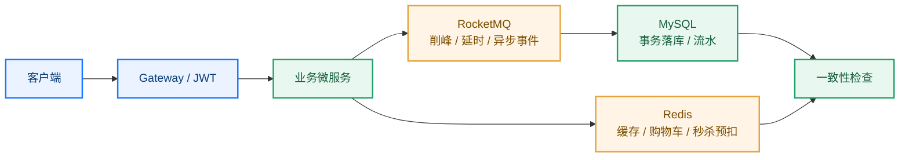

# 叮咚商城开发迭代说明

> [!abstract] 开发目标
> 2026-07-23 前交付可重复启动、可展示买家端与管理端页面的 `v0.9` 实训版。Docker Compose 负责后端中间件，Java 服务在本机手动启动；前端始终独立构建与发布，不加入 Compose。

## 1. 开发原则

- 先验证基础设施，再实现业务功能。
- 先确定数据模型和接口契约，再编写页面与服务代码。
- 优先保证登录、商品浏览、购物车、下单、模拟支付主路径。
- 每次提交保持小而完整，避免把多个无关功能混在一起。
- 07-22 起只修复缺陷，不再扩展新增业务范围。

## 2. 截止日前迭代节奏

| 日期 | 迭代目标 | 交付物 |
|---|---|---|
| 07-15 至 07-16 | 工程基线与中间件 | Compose、数据库脚本、服务骨架、启动说明 |
| 07-16 至 07-18 | 用户与商品 | 登录、用户/地址、分类、品牌、SPU/SKU 接口 |
| 07-18 至 07-20 | 交易主链路 | 购物车、订单创建、库存校验、订单查询 |
| 07-20 至 07-21 | 支付与状态 | 模拟支付、支付事件、发货状态 |
| 07-21 至 07-22 | 集成与联调 | 前后端联调、异常修复、演示数据和脚本 |
| 07-23 | 交付与展示 | Docker Compose 演示、页面展示、问题修复 |

## 3. 普通开发流程

1. 阅读 [[PRD|产品需求文档]] 与接口约定，明确本次迭代的验收条件。
2. 从 `main` 创建功能分支，先补充数据表或接口草案。
3. 完成服务端实现、单元/接口自测和必要的版本化接口文档。
4. 完成前端页面或调用示例，并进行一次端到端联调。
5. 提交前执行 Maven 编译、相关测试和 `git diff --check`。
6. 合并后重新启动 Compose 与受影响服务，确认主路径没有回归。

## 4. 每项任务的完成标准

- [ ] 代码可编译，未提交 `target/`、本地配置或密码。
- [ ] 接口文档包含请求、响应和主要错误码。
- [ ] 正常、无权限、参数错误三类场景已自测。
- [ ] 数据库变更使用版本化 SQL 脚本。
- [ ] 页面或接口已完成一次前后端联调。
- [ ] 变更已补充 README、演示数据或运行说明（如适用）。

## 5. Git 与变更约定

- 分支命名、提交格式和合并方式遵循 [[GIT|Git 流程说明]]。
- 接口字段、枚举、状态码变化时，先更新文档再修改调用方。
- 卡住超过 30 分钟时记录现象、已尝试操作和报错，避免无记录重复试错。
- 影响订单、库存或支付的数据问题优先处理，并在合并前完成回归验证。

## 6. 当前实施状态（2026-07-22）

当前处于 **v0.8 全栈联调收口、v0.9 交付准备** 阶段。核心交易链路与管理端主功能已经完成运行态验收，后续以文档冻结、演示复核和可靠性增强为主。

| 区域 | 当前状态 | 依据与边界 |
|---|---|---|
| 基础设施 | 已完成 | Compose 已覆盖 MySQL、Redis、Nacos、RocketMQ，Java 服务仍以本机进程运行。 |
| 服务治理 | 已完成 | 五个服务默认启用 Nacos 服务发现；Gateway 通过 `lb://服务名` 路由健康实例。 |
| 后端业务 | 主路径已完成并联调 | Redis 购物车、订单状态流转、库存生命周期、模拟支付、延时关单、Outbox 和秒杀异步链路均已有实现。 |
| 买家端前端 | 联调完成 | 密码/Mock 短信登录、商品、购物车、地址、下单、模拟支付和模拟物流展示均已接入。 |
| 管理端前端 | 联调完成 | 商品、GitHub 图床、订单、用户、经营概览和秒杀控制台均已接入。 |
| API 文档 | Markdown 契约已对齐 | 使用 v0.2–v0.6 版本化 Markdown 契约；不引入运行时文档生成组件。 |
| 测试与验收 | 核心闭环通过 | 后端 22 项测试通过，前端生产构建通过；交易主链路已通过 Gateway 联调。 |
| 部署边界 | 已冻结 | Compose 编排中间件；Java 服务手动运行；前端独立启动与发布。 |

### 6.1 联调验收基线

| 验收项 | 结果 | 证据口径 |
|---|---|---|
| 购物车与立即购买 | 通过 | Redis 正常读写，只结算指定商品 |
| 支付状态闭环 | 通过 | `PENDING_PAYMENT` 经模拟支付迁移为 `PAID` |
| 账户维护 | 通过 | 地址、联系方式和密码修改可用 |
| 管理运营 | 通过 | 商品、订单、用户和经营统计接入真实接口 |
| 构建与测试 | 通过 | 前端生产构建通过；后端 22 项测试通过 |

## 7. 亮点介绍

> 按“技术方案 + 解决的问题 + 业务结果”描述，仅保留架构、并发和可靠性能力，不罗列常规 CRUD。

- 基于 **Spring Cloud Alibaba、Gateway、Nacos 与 Dubbo** 拆分用户、商品、订单、支付微服务，通过服务发现、负载路由和独立数据 schema 明确服务边界，避免服务间跨库耦合。
- 基于 **JWT + Gateway GlobalFilter** 实现统一令牌鉴权，并在下游服务二次校验用户状态和管理员角色；使用 **Spring Security Crypto / BCrypt** 存储密码，形成网关与服务双层安全边界。
- 基于 **Redis Hash** 实现用户购物车，结合商品 RPC 动态补全价格、库存和有效状态；商品详情采用 Cache-Aside 思路缓存，并在管理操作后主动失效。
- 通过 **GitHub Contents API** 建设商品图床，统一商品主图与品牌 Logo 上传、URL 回填、文件类型和大小校验；敏感 Token 仅通过环境变量注入。
- 设计“**可用库存—锁定库存—销量**”三段式库存模型，通过 SKU 行锁、条件更新、业务幂等键和库存变更流水，防止并发下单造成超卖或重复扣减。
- 面向秒杀场景，使用 **Redis Lua** 原子完成库存预扣、一人一单和请求防重，借助 **RocketMQ** 削峰异步落库，并提供失败回补及 Redis/MySQL 最终一致性检查。
- 基于订单状态机约束 `PENDING_PAYMENT → PAID → SHIPPED → COMPLETED` 等合法迁移，结合 **RocketMQ 延时消息 + Outbox** 实现超时关单和消息发送重试。
- 围绕重复请求和重复消息，为下单、库存、支付单和消息消费分别设计幂等边界，保证支付确认、库存释放和异步落库不会被重复执行。
- 在支付、购物车和跨服务能力中分别应用 **策略模式、仓储模式与 Facade 模式**，隔离渠道实现、存储细节和 RPC 契约，提升核心链路的可替换性与可测试性。

### 7.1 可以新增的特征方向

以下内容尚未实现，不计入当前亮点：

| 方向 | 建议能力 |
|---|---|
| Redis 限流 | Gateway + Redis Lua 令牌桶，对登录、短信和秒杀入口按用户/IP 限流 |
| 图床增强 | 增加图片删除、孤儿文件清理、CDN 与上传审计 |
| 真实短信 | 第三方资质通过后接入云短信适配层；当前保留 Redis TTL、频控和 Mock 前端闭环 |
| 可观测性 | Micrometer + Prometheus + Grafana，展示接口耗时、库存失败率和消息积压 |
| 消息可靠性 | 支付 Outbox、事务消息、死信队列和人工补偿入口 |
| 自动化压测 | 固化秒杀并发脚本，量化吞吐、成功率、无超卖和最终收敛时间 |

## 8. 交付前剩余清单

1. [x] 补齐管理员订单列表与详情接口，使管理端订单查询、详情和发货可形成闭环。
2. [x] 图片策略冻结为 GitHub 图床：管理端通过 `/api/files` 上传并回填公开 URL，也兼容手工 URL。
3. [x] 冻结 v0.6 Markdown 接口契约；明确不引入 SpringDoc 等运行时文档组件。
4. [x] 以 Gateway 为入口完成买家端、商品管理端和订单履约的端到端联调。
5. [ ] 补充可重复的高并发压测与消息故障恢复脚本；当前已提供秒杀控制台与一致性检查接口。
6. [x] 补充初始化演示数据、默认管理员说明和本地启动/关闭流程。
7. [x] 冻结部署边界：Compose 启动中间件，Java 手动启动，前端独立构建发布；完成一次完整运行态验收。

## 9. 交付日前只做收口

1. 以版本化 Markdown 为准冻结接口字段和错误码，并补契约回归测试。
2. 把已完成的人工联调步骤沉淀为可重复的最小验收脚本。
3. 演示支付幂等、订单超时关闭、库存释放与秒杀最终一致性；不扩展真实支付、真实物流或个性化推荐。
4. 按 README 从停止状态重新启动一次，复核演示账号、Mock 验证码、GitHub 图床和关键页面。
