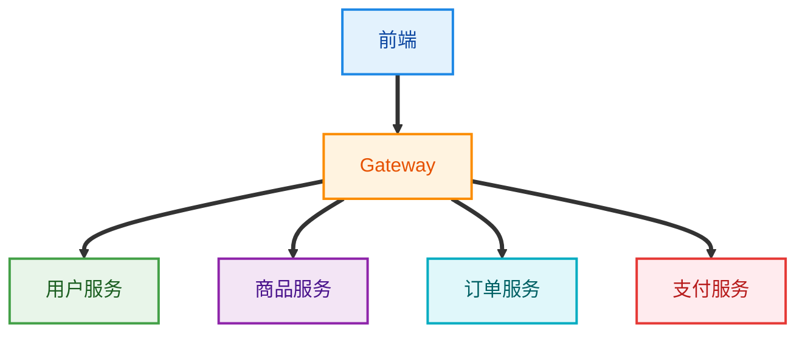
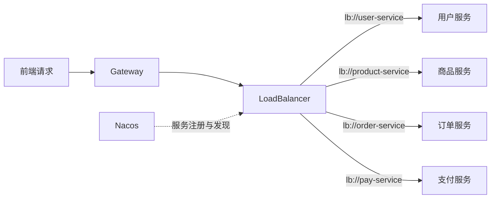
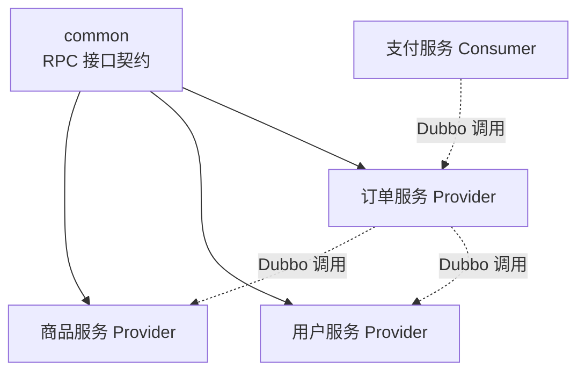
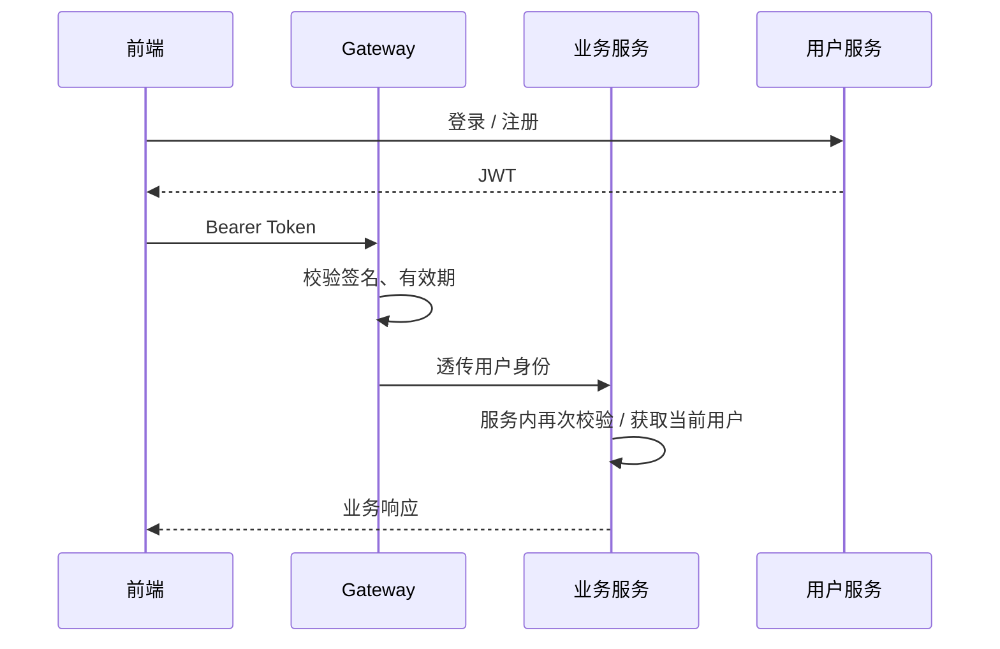
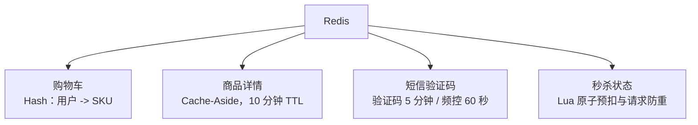
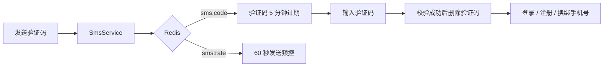
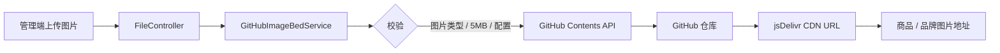
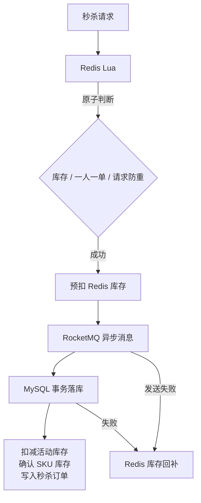
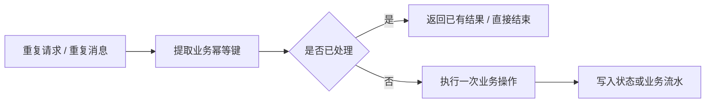
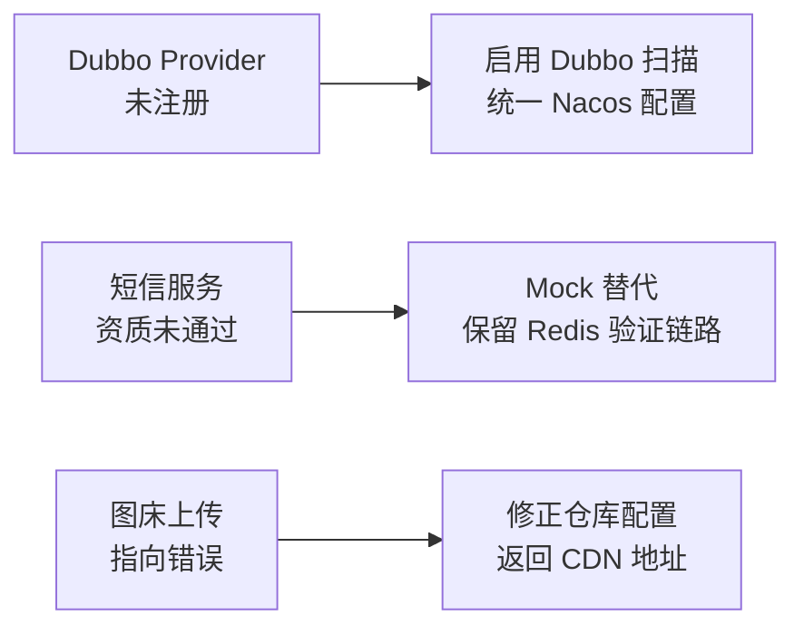

# 叮咚商城项目报告

## 1. 项目简介

叮咚商城是一个基于 Spring Cloud Alibaba 治理开发的前后端分离电商项目平台。

项目在传统 Java Web 单体应用的基础上，适应电商场景高并发需求，进一步拆分为微服务架构，引入 Nacos、Dubbo、RocketMQ、Redis 等组件，实现服务注册发现、跨服务 RPC、异步消息队列、缓存与高并发秒杀治理。

***技术栈***

**前端：** *Vue3、TypeScript、Vite、Element-Plus*

**后端：**

- *Java 21*
- *Spring Boot v3.5.0*
- *Spring Cloud v2025.0.0*
- ***Spring Cloud Alibaba | v2025.0.0.0***
- - *Nacos |v3.0.3* : 服务注册配置中心
- - *LoadBalancer* : 请求转发负载均衡组件
- - *Dubbo* : 远程过程调用 (RPC) 中间件
- - *RocketMQ | v5.3.1* : 消息队列中间件
- *Redis | v7.4* : 缓存中间件
- *MyBatis* : 数据库连接层
- *MySQL* : 业务数据持久化

项目中间件使用 *Docker Compose* 编排。

## 2. 模块及其分工

**小组成员** *(共4人)* ：吴占晟、杨添锦、彭一帆、朱笔锋

| 模块       | 说明                              | 负责人 |
| ---------- | --------------------------------- | ------ |
| 微服务框架 | Nacos 治理、Dubbo RPC             | 吴占晟 |
| 网关服务   | 统一入口、JWT 校验、请求路由      | 吴占晟 |
| 用户服务   | 用户管理 CRUD、短信认证、JWT 鉴权 | 彭一帆 |
| 商品服务   | 商品管理 CRUD、图床服务           | 朱笔锋 |
| 订单服务   | Redis 缓存、秒杀场景治理          |        |

**整体架构**

## 3. 项目亮点

### 微服务架构设计

**服务注册与发现**

Gateway 接收前端统一的 `/api` 请求，`GatewayRouteConfig` 按路径转发到服务名；`lb://服务名` 由 Nacos 服务发现和 LoadBalancer 找到可用实例。

**代码落点：** `GatewayRouteConfig`、`JwtGatewayFilter`、各服务的 `application.yml`。

**Dubbo 实现远程服务调用**

`common` 模块打包为独立 JAR，被各服务作为 Maven 依赖引入。服务之间共享的是 `ProductInventoryFacade`、`UserAddressFacade`、`OrderPaymentFacade` 等接口契约，而不是直接访问对方数据库。

**实际业务：** 下单时订单服务通过 Dubbo 获取地址快照、校验并锁定库存；支付服务通过 Dubbo 获取可支付订单；支付成功后订单服务再调用商品服务确认库存。

### JWT 登陆认证功能

用户服务登录成功后签发 JWT。请求先经过 Gateway 校验签名和有效期，再由下游服务按自身安全边界进行校验；用户服务还会查库确认账户未被禁用。

**代码落点：** `JwtGatewayFilter`、`JwtAuthenticationFilter`、`JwtTokenService`、各服务的 JWT Filter。

### 缓存设计

- 购物车使用 Redis Hash 持久保存，结算前通过商品 RPC 补全最新价格、库存和商品状态。
- 商品详情采用 Cache-Aside；管理端修改商品或 SKU 后主动失效缓存，Redis 异常时回退 MySQL。

**代码落点：** `RedisCartRepository`、`ProductDetailCacheService`。

### 短信验证功能

当前未接入真实短信供应商，但 `SmsService` 仍完整实现验证码生成、Redis 存储、5 分钟过期、60 秒频控和成功后删除；Mock 模式下通过 `debugCode` 返回验证码，保证本地演示链路可闭环。

**代码落点：** `AuthController`、`SmsService`、`UserService`。

### 图床服务功能

商品服务通过 GitHub Contents API 上传图片：校验文件类型和大小后，以随机文件名、Base64 内容和指定分支写入图床仓库，再返回 jsDelivr CDN 地址。仓库、分支和 Token 均通过配置或环境变量注入，不写入代码。

**代码落点：** `FileController`、`GitHubImageBedService`、`GitHubImageBedProperties`。

### 秒杀场景治理

**结果：** 高峰请求先在 Redis 中快速失败或排队，数据库只处理进入消息队列的请求；通过 `requestId`、数据库查询和库存流水避免重复落库，并提供 Redis/MySQL 库存一致性检查。

### 幂等设计

- **下单：** 使用用户维度的 `requestId` 写入 `order_request`；重复提交时返回已创建订单，避免重复下单。
- **支付与关单：** 只有 `PENDING_PAYMENT` 才能迁移到 `PAID` 或 `CANCELED`，重复消费不会再次确认或释放库存。
- **库存调整：** 使用 `ADMIN_ADJUST:requestId` 作为库存流水业务键，重复操作直接返回已有记录。
- **秒杀：** Redis Lua 同时校验请求 ID 和用户购买标记，数据库落库前再次按 `requestId` 查询，消息重复消费不会重复创建订单。

**核心思想：** 幂等不是只依赖前端防重复点击，而是由 Redis 状态、数据库业务键和条件更新共同保证。

## 4. 开发问题与解决

| Bug | 现象与原因 | 解决 |
| --- | --- | --- |
| **微服务配置错误** | 商品服务未启用 Dubbo Provider 扫描，订单服务无法发现库存 RPC 实现 | 增加 `@EnableDubbo` 扫描 RPC 包；Nacos 地址改由环境变量统一注入 |
| **短信服务不可用** | 第三方短信签名、模板资质未通过，真实验证码无法发送 | 使用 Mock 模式返回 `debugCode`；仍通过 Redis 实现 5 分钟过期、60 秒频控和成功后删除 |
| **图床上传指向错误** | GitHub 仓库配置和公开访问地址不一致，导致上传失败或图片不可访问 | 校验 `owner/repository`，统一注入仓库、分支和 Token；上传后返回 jsDelivr CDN 地址 |

**工程认识：** 问题修复不只追求“能够运行”，还要保留可替换接口、配置边界和失败提示，为后续接入真实基础设施留下扩展点。
